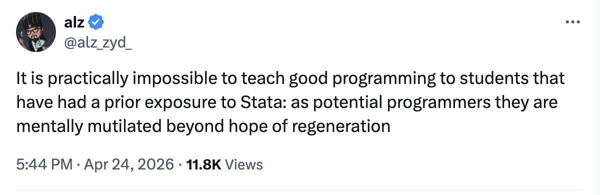

# Solutions Manual for Bruce E. Hansen's *Econometrics*

This repository contains  the accompanying code for my book, [Solutions Manual for Econometrics by Bruce E. Hansen: A Patient and Pedagogical Approach] (https://www.amazon.com/Solution-Manual-Econometrics-Bruce-Hansen/dp/B0H56946L7/ref=tmm_pap_swatch_0).

## Python
I provide implementations for all empirical exercises in **Python**.

Students often ask whether Stata code is available. As the tweet below suggests (from Anthony Zhang, a brilliant professor of finance at the University of Chicago), long-term exposure to certain languages can be... difficult to recover from.

If you are a student and have not yet decided which programming language to learn, let me offer a suggestion out of love: choose Python. I wrote this 500-something-page solutions manual out of love for ambitious graduate students, and I offer the same advice in that spirit.

## Contributions
I do not currently have an R version of these solutions, since I am not an R user. If you would like to contribute an R implementation, or an implementation in any other language, pull requests are very welcome and will be credited.

## Feedback
Your input is invaluable. Whether you notice a typo in the manual or an opportunity to improve the code, please do not hesitate to point it out.
